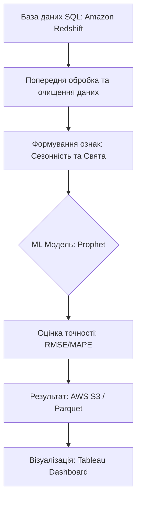

# business_forecasting1
### План виконання (посилання на задачі):
1. [Написання ТЗ](#1)
2. [Формування Датасету](#2)
3. [Вибір та запуск моделі](#3)
4. [Вибір та оцінка метрик](#4)
5. [Формування звіту з результатами](#5)

**Фіналізація результатів:** Детальний статус виконання кожної задачі та рух по етапах можна побачити на [KANBAN дошці](https://github.com/users/bozhenaaaaa/projects/2/views/1).

# Технічне завдання: Прогнозування товарообігу мережі (Amazon Case)

### 1. Назва проєкту
«Розробка алгоритму прогнозування товарообігу мережі електроніки для оптимізації складських запасів»

### 2. Тип моделі
Prophet

### 3. Посилання на таски (Kanban)
Усі етапи розробки зафіксовані в [GitHub Projects за цим посиланням](https://github.com/users/bozhenaaaaa/projects/2/views/1):
* [Написання ТЗ](#1)
* [Формування Датасету](#2)
* [Вибір та запуск моделі](#3)
* [Вибір та оцінка метрик](#4)
* [Формування звіту](#5)

### 4. Дата запуску в продакшн
Планова дата інтеграції: **Червень 2026 року** (кінець семестру).

### 5. Розміщення проєкту
* **Репозиторій:** [GitHub Link](https://github.com/bozhenaaaaa/business_forecasting1/tree/main)
* **Джерела даних:** SQL-бази даних транзакцій (Amazon Redshift), API складських залишків.
* **Результати:** Прогноз зберігається в таблицю AWS S3 у форматі `.parquet`.
* **Передача даних:** Дані передаються в систему автоматичних закупівель (Inventory Management System).

### 6. Регулярність запуску
**Щотижня** (щопонеділка о 00:00) для планування логістики на наступні 7-14 днів.

### 7. Замовник
Департамент логістики та управління ланцюгами постачань (Supply Chain Management Dept).

### 8. Розробник(и)
Data Scientist / Аналітик даних (Шимко).

### 9. Яка проблема вирішується
Зменшення витрат на зберігання надлишків товарів на складах (Overstock) та мінімізація ситуацій відсутності товару в наявності (Out-of-stock).

### 10. Бізнес-вимоги
Прогноз має інтегруватися в Tableau Dashboards для менеджерів складів. Похибка не повинна перевищувати 10% у грошовому еквіваленті.

### 11. Метрики якості
* **RMSE** (Root Mean Square Error) — для оцінки відхилення в одиницях товару.
* **MAPE** (Mean Absolute Percentage Error) — для оцінки відносної похибки.

### 12. Виключення з прогнозу
Не прогнозуються товари, що зняті з виробництва, та замовлення зі статусом "B2B Bulk Purchase" (гурт).

### 13. Особливості / Обмеження
Необхідно враховувати сезонні піки (Black Friday, Prime Day).

### 14. Економічна ефективність
Очікуване скорочення логістичних витрат на 15% за рахунок точного розподілу товарів між регіональними хабами.

### 15. Презентація
[[Посилання на презентацію в Canva](https://www.canva.com/design/DAHEB915vRo/xAJ55x5HPlqLB1RPfYJc5Q/edit?utm_content=DAHEB915vRo&utm_campaign=designshare&utm_medium=link2&utm_source=sharebutton)] «Презентація готується до фінального захисту проєкту (кінець семестру).»

### 16. Детальний опис проєкту
* **Функціональні вимоги:** Система повинна автоматично вивантажувати історичні дані про продажі, проводити їх очищення, враховувати календар маркетингових активностей (Prime Day, Black Friday) та генерувати прогноз попиту на наступні 30 днів з розбивкою по категоріях.
* **Flow роботи (алгоритм):**
    1.  **Ingestion:** Отримання сирих даних з AWS Redshift.
    2.  **Validation:** Перевірка цілісності даних.
    3.  **Processing:** Видалення аномальних сплесків (повернень) та заповнення пропусків.
    4.  **Modeling:** Запуск моделі Prophet для розрахунку прогнозних значень.
    5.  **Export:** Передача результатів у Tableau для візуалізації.

* **Блок-схема процесу:**

### 17. Вимоги до даних
**Структура даних:** використовується структурований датасет історичних продажів мережі маркетплейсу. Основні поля:
* `date` (в моделі **ds**) — дата продажу;
* `category_id` — ідентифікатор категорії товару;
* `revenue_retail` (в моделі **y**) — обсяг продажів у грошовому вираженні (товарообіг);
* `margin` — маржинальність продажів.

**Формат та оновлення:** дані зберігаються у табличному форматі (CSV або таблиця бази даних) з єдиним стандартним форматом дат (**YYYY-MM-DD**) і валідними числовими значеннями. Датасет оновлюється регулярно, а аномальні та тестові записи видаляються перед використанням для забезпечення чистоти прогнозу.

**Інтеграція у системи:** дані завантажуються з внутрішньої бази даних і після прогнозування результати передаються у BI-систему  для фінансового планування та аналітики.

### 18. Інтерфейс користувача
Веб-інтерфейс не потрібен. Результати відображаються у існуючому BI-інструменті.

### 19. Ризики
Зміна алгоритмів ранжування товарів на Amazon, що може різко змінити попит; затримки в оновленні бази даних.

### 20. Примітки
"Проєкт знаходиться в стадії активної розробки. Поточні статуси завдань оновлюються на Kanban-дошці."
